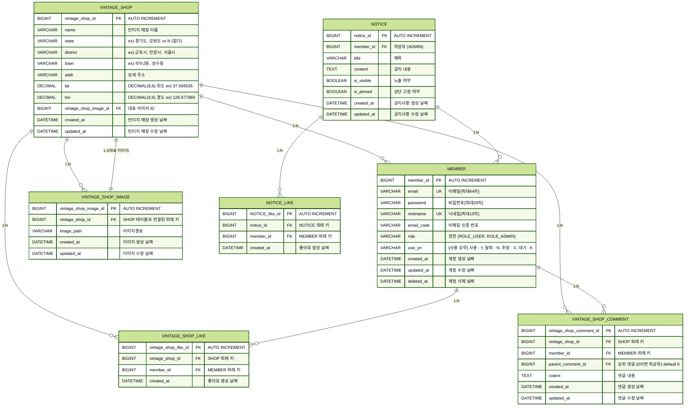

```mermaid
---
config:
  theme: forest
---
erDiagram
    MEMBER {
        BIGINT member_id PK "AUTO INCREMENT"
        VARCHAR email UK "이메일[최대64자]"
        VARCHAR password "비밀번호[최대20자]"
        VARCHAR nickname UK "닉네임[최대10자]"
        VARCHAR email_code "이메일 인증 번호"
        VARCHAR role "권한 (ROLE_USER, ROLE_ADMIN)"
        VARCHAR use_yn "[사용 유무] 사용 : Y, 탈퇴 : N, 추방 : X, 대기 : K"
        DATETIME created_at "계정 생성 날짜"
        DATETIME updated_at "계정 수정 날짜"
        DATETIME deleted_at "계정 삭제 날짜"
    }
    
    VINTAGE_SHOP {
        BIGINT vintage_shop_id PK "AUTO INCREMENT"
        VARCHAR name "빈티지 매장 이름"
        VARCHAR state "ex) 경기도, 강원도 or N (없다)"
        VARCHAR district "ex) 군포시, 안양시, 서울시"
        VARCHAR town "ex) 석수2동, 성수동"
        VARCHAR addr "상세 주소"
        DECIMAL lat "DECIMAL(9,6) 위도 ex) 37.566535"
        DECIMAL lon "DECIMAL(9,6) 경도 ex) 126.977969"
        BIGINT vintage_shop_image_id FK "대표 이미지 ID"
        DATETIME created_at "빈티지 매장 생성 날짜"
        DATETIME updated_at "빈티지 매장 수정 날짜"
    }
    
    VINTAGE_SHOP_IMAGE {
        BIGINT vintage_shop_image_id PK  "AUTO INCREMENT"
        BIGINT vintage_shop_id FK "SHOP 테이블과 연결된 외래 키"
        VARCHAR image_path "이미지경로"
        DATETIME created_at "이미지 생성 날짜"
        DATETIME updated_at "이미지 수정 날짜"
    }

    VINTAGE_SHOP_LIKE {
        BIGINT vintage_shop_like_id PK "AUTO INCREMENT"
        BIGINT vintage_shop_id FK "SHOP 외래 키"
        BIGINT member_id FK "MEMBER 외래 키"
        DATETIME created_at "좋아요 생성 날짜"
    }
    
    VINTAGE_SHOP_COMMENT {
        BIGINT vintage_shop_comment_id PK "AUTO INCREMENT"
        BIGINT vintage_shop_id FK "SHOP 외래 키"
        BIGINT member_id FK "MEMBER 외래 키"
        BIGINT parent_comment_id FK "상위 댓글 (0이면 최상위) default 0"
        TEXT cotent "댓글 내용"
        DATETIME created_at "댓글 생성 날짜"
        DATETIME updated_at "댓글 수정 날짜"
    }
    
    NOTICE {
        BIGINT notice_id PK "AUTO INCREMENT"
        BIGINT member_id FK "작성자 (ADMIN)"
        VARCHAR title "제목"
        TEXT content "공지 내용"
        BOOLEAN is_visible "노출 여부"
        BOOLEAN is_pinned "상단 고정 여부"
        DATETIME created_at "공지사항 생성 날짜"
        DATETIME updated_at "공지사항 수정 날짜"
    }

    NOTICE_LIKE {
        BIGINT NOTICE_like_id PK "AUTO INCREMENT"
        BIGINT notice_id FK "NOTICE 외래 키"
        BIGINT member_id FK "MEMBER 외래 키"
        DATETIME created_at "좋아요 생성 날짜"
    }

    VINTAGE_SHOP ||--o{ VINTAGE_SHOP_IMAGE : "1:N"
    VINTAGE_SHOP_IMAGE ||--|| VINTAGE_SHOP : "1:1(대표 이미지)"
    VINTAGE_SHOP ||--o{ VINTAGE_SHOP_LIKE : "1:N"
    VINTAGE_SHOP ||--o{ MEMBER : "1:N"
    VINTAGE_SHOP ||--o{ VINTAGE_SHOP_COMMENT : "1:N"
    MEMBER ||--o{ VINTAGE_SHOP_COMMENT : "1:N"
    MEMBER ||--o{ VINTAGE_SHOP_LIKE : "1:N"
    NOTICE ||--o{ NOTICE_LIKE : "1:N"
    NOTICE ||--o{ MEMBER : "1:N"
    
    
```
