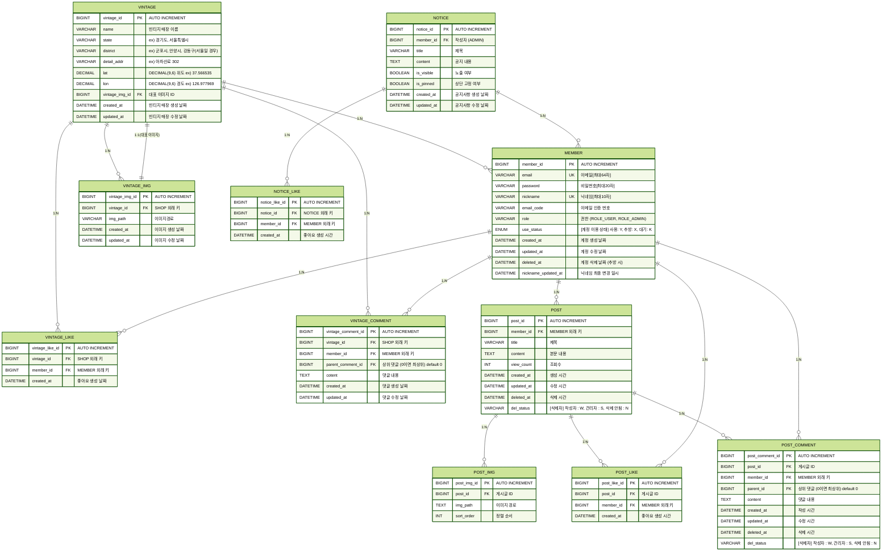

```mermaid
---
config:
  theme: forest
---
erDiagram
    MEMBER {
        BIGINT member_id PK "AUTO INCREMENT"
        VARCHAR email UK "이메일[최대64자]"
        VARCHAR password "비밀번호[최대20자]"
        VARCHAR nickname UK "닉네임[최대10자]"
        VARCHAR email_code "이메일 인증 번호"
        VARCHAR role "권한 (ROLE_USER, ROLE_ADMIN)"
        ENUM use_status "[계정 이용 상태] 사용: Y, 추방: X, 대기: K"
        DATETIME created_at "계정 생성 날짜"
        DATETIME updated_at "계정 수정 날짜"
        DATETIME deleted_at "계정 삭제 날짜 (추방 시)"
        DATETIME nickname_updated_at "닉네임 최종 변경 일시"
    }
    
    VINTAGE {
        BIGINT vintage_id PK "AUTO INCREMENT"
        VARCHAR name "빈티지 매장 이름"
        VARCHAR state "ex) 경기도, 서울특별시"
        VARCHAR district "ex) 군포시, 안양시, 강동구(서울일 경우)"
        VARCHAR detail_addr "ex) 아차산로 302"
        DECIMAL lat "DECIMAL(9,6) 위도 ex) 37.566535"
        DECIMAL lon "DECIMAL(9,6) 경도 ex) 126.977969"
        BIGINT vintage_img_id FK "대표 이미지 ID"
        DATETIME created_at "빈티지 매장 생성 날짜"
        DATETIME updated_at "빈티지 매장 수정 날짜"
    }
    
    VINTAGE_IMG {
        BIGINT vintage_img_id PK  "AUTO INCREMENT"
        BIGINT vintage_id FK "SHOP 외래 키"
        VARCHAR img_path "이미지경로"
        DATETIME created_at "이미지 생성 날짜"
        DATETIME updated_at "이미지 수정 날짜"
    }

    VINTAGE_LIKE {
        BIGINT vintage_like_id PK "AUTO INCREMENT"
        BIGINT vintage_id FK "SHOP 외래 키"
        BIGINT member_id FK "MEMBER 외래 키"
        DATETIME created_at "좋아요 생성 날짜"
    }
    
    VINTAGE_COMMENT {
        BIGINT vintage_comment_id PK "AUTO INCREMENT"
        BIGINT vintage_id FK "SHOP 외래 키"
        BIGINT member_id FK "MEMBER 외래 키"
        BIGINT parent_comment_id FK "상위 댓글 (0이면 최상위) default 0"
        TEXT cotent "댓글 내용"
        DATETIME created_at "댓글 생성 날짜"
        DATETIME updated_at "댓글 수정 날짜"
    }
    
    NOTICE {
        BIGINT notice_id PK "AUTO INCREMENT"
        BIGINT member_id FK "작성자 (ADMIN)"
        VARCHAR title "제목"
        TEXT content "공지 내용"
        BOOLEAN is_visible "노출 여부"
        BOOLEAN is_pinned "상단 고정 여부"
        DATETIME created_at "공지사항 생성 날짜"
        DATETIME updated_at "공지사항 수정 날짜"
    }

    NOTICE_LIKE {
        BIGINT notice_like_id PK "AUTO INCREMENT"
        BIGINT notice_id FK "NOTICE 외래 키"
        BIGINT member_id FK "MEMBER 외래 키"
        DATETIME created_at "좋아요 생성 시간"
    }

    POST {
        BIGINT post_id PK "AUTO INCREMENT"
        BIGINT member_id FK "MEMBER 외래 키"
        VARCHAR title "제목"
        TEXT content "본문 내용"
        INT view_count "조회수"
        DATETIME created_at "생성 시간"
        DATETIME updated_at "수정 시간"
        DATETIME deleted_at "삭제 시간"
        VARCHAR del_status "[삭제자] 작성자 : W, 관리자 : S, 삭제 안됨 : N"
    }

    POST_IMG {
        BIGINT post_img_id PK "AUTO INCREMENT"
        BIGINT post_id FK "게시글 ID"
        TEXT img_path "이미지 경로"
        INT sort_order "정렬 순서"
    }

    POST_LIKE {
        BIGINT post_like_id PK "AUTO INCREMENT"
        BIGINT post_id FK "게시글 ID"
        BIGINT member_id FK "MEMBER 외래 키"
        DATETIME created_at "좋아요 생성 시간"
    }

    POST_COMMENT {
        BIGINT post_comment_id PK "AUTO INCREMENT"
        BIGINT post_id FK "게시글 ID"
        BIGINT member_id FK "MEMBER 외래 키"
        BIGINT parent_id FK "상위 댓글 (0이면 최상위) default 0"
        TEXT content "댓글 내용"
        DATETIME created_at "작성 시간"
        DATETIME updated_at "수정 시간"
        DATETIME deleted_at "삭제 시간"
        VARCHAR del_status "[삭제자] 작성자 : W, 관리자 : S, 삭제 안됨 : N"
    }

    VINTAGE ||--o{ VINTAGE_IMG : "1:N"
    VINTAGE_IMG ||--|| VINTAGE : "1:1(대표 이미지)"
    VINTAGE ||--o{ VINTAGE_LIKE : "1:N"
    VINTAGE ||--o{ MEMBER : "1:N"
    VINTAGE ||--o{ VINTAGE_COMMENT : "1:N"
    MEMBER ||--o{ VINTAGE_COMMENT : "1:N"
    MEMBER ||--o{ VINTAGE_LIKE : "1:N"
    NOTICE ||--o{ NOTICE_LIKE : "1:N"
    NOTICE ||--o{ MEMBER : "1:N"

    MEMBER ||--o{ POST : "1:N"
    POST ||--o{ POST_IMG : "1:N"
    POST ||--o{ POST_LIKE : "1:N"
    MEMBER ||--o{ POST_LIKE : "1:N"
    POST ||--o{ POST_COMMENT : "1:N"
    MEMBER ||--o{ POST_COMMENT : "1:N"
```
