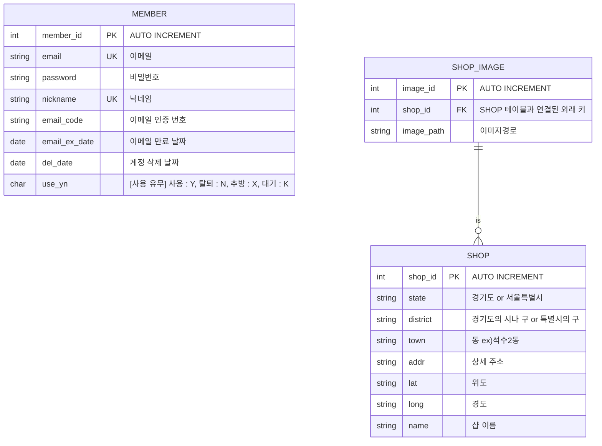

```mermaid
erDiagram
    MEMBER {
        int member_id PK "AUTO INCREMENT"
        string email UK "이메일"
        string password "비밀번호"
        string nickname UK "닉네임"
        string email_code "이메일 인증 번호"
        date email_ex_date "이메일 만료 날짜"
        date del_date "계정 삭제 날짜"
        char use_yn "[사용 유무] 사용 : Y, 탈퇴 : N, 추방 : X, 대기 : K"
    }
    
    SHOP {
        int shop_id PK "AUTO INCREMENT"
        string state "경기도 or 서울특별시"
        string district "경기도의 시나 구 or 특별시의 구"
        string town "동 ex)석수2동"
        string addr "상세 주소"
        string lat "위도"
        string long "경도"
        string name "샵 이름"
    }
    SHOP_IMAGE ||--o{ SHOP : is
    SHOP_IMAGE {
        int image_id PK  "AUTO INCREMENT"
        int shop_id FK "SHOP 테이블과 연결된 외래 키"
        string image_path "이미지경로"
    }
```
