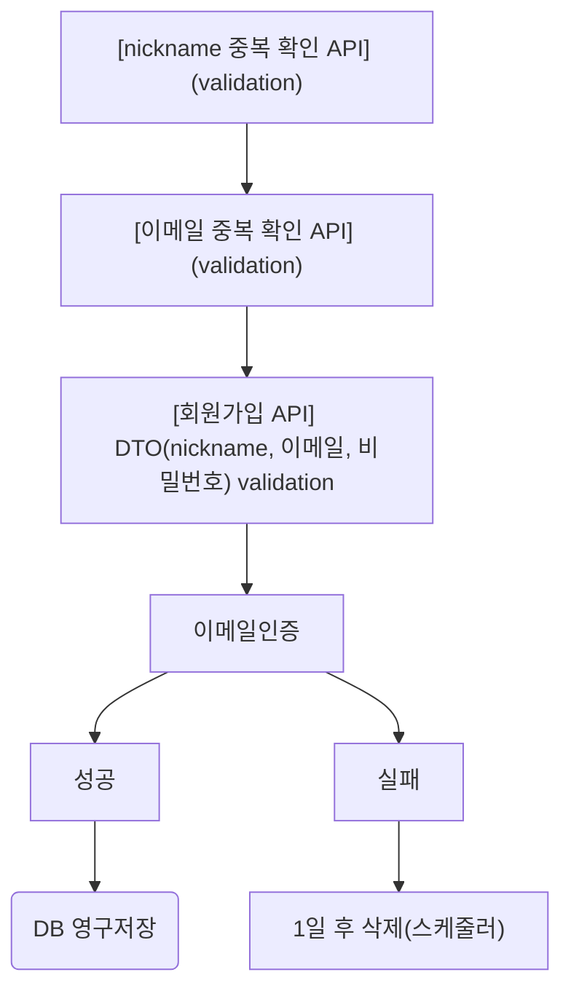

```mermaid
flowchart TD
    nicknameChk["`[nickname 중복 확인 API] (validation)`"]
    emailChk["`[이메일 중복 확인 API] (validation)`"]
    임시회원가입["[회원가입 API] DTO(nickname, 이메일, 비밀번호) validation"]
    이메일인증
    
    nicknameChk --> emailChk --> 임시회원가입 --> 이메일인증
    이메일인증 --> 성공 --> 저장("DB 영구저장")
    이메일인증 --> 실패 --> 삭제["1일 후 삭제(스케줄러)"]
```
